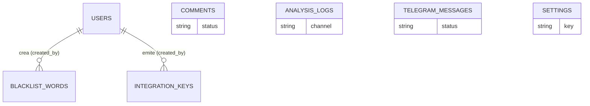

**UNIVERSIDAD PRIVADA DE TACNA**

**FACULTAD DE INGENIERÍA**

**Escuela Profesional de Ingeniería de Sistemas**

**Proyecto Antispam**

Curso: SI784 – Calidad y Pruebas de Software

Integrantes:
* Jahuira Pilco, Dayan Elvis (2022075749)
* Mamani Cori, Cristhian Carlos (2023077282)

Tacna – Perú

2026

---

Sistema Antispam
**Diccionario de Datos**
Versión 1.0

---

## CONTROL DE VERSIONES

| Versión | Hecha por | Fecha | Motivo |
|--------|----------|-------|--------|
| 1.0 | Cristhian M. | 25/06/2026 | Versión original — generado a partir de las migraciones reales (`src/database/migrations/`) |

---

## 1. INTRODUCCIÓN

Este documento describe la estructura física de la base de datos MySQL 8 utilizada por Aegis Filter. La base de datos tiene **8 tablas propias del dominio** (`users`, `comments`, `blacklist_words`, `settings`, `integration_keys`, `analysis_logs`, `telegram_messages`) más las tablas de infraestructura que Laravel genera por defecto (`password_reset_tokens`, `sessions`, `cache`, `cache_locks`, `jobs`). El motor de base de datos es MySQL 8.0 con charset `utf8mb4` y collation `utf8mb4_unicode_ci` (ver `docker-compose.yml`).

Cada tabla corresponde a un modelo Eloquent en `src/app/Models/`. La fuente de verdad de este diccionario son las migraciones en `src/database/migrations/`.

---

## 2. TABLAS DEL DOMINIO

### 2.1. `users`

Cuentas de administrador del panel. No existe registro público; los usuarios se crean por seeder o `php artisan tinker`.

| Campo | Tipo | Null | Default | Descripción |
|---|---|---|---|---|
| id | bigint unsigned (PK, AI) | No | — | Identificador único |
| name | varchar(255) | No | — | Nombre del administrador |
| email | varchar(255) | No | — | Correo, único (`UNIQUE`) |
| email_verified_at | timestamp | Sí | NULL | Fecha de verificación de correo |
| password | varchar(255) | No | — | Hash bcrypt de la contraseña |
| remember_token | varchar(100) | Sí | NULL | Token de "recordarme" |
| created_at / updated_at | timestamp | Sí | NULL | Auditoría estándar de Laravel |

**Índices:** `email` (UNIQUE).
**Relaciones:** `1:N` con `blacklist_words.created_by` y `1:N` con `integration_keys.created_by`.

---

### 2.2. `comments`

Tabla principal del foro público (canal `web`). Cada fila es un comentario enviado y su resultado de moderación.

| Campo | Tipo | Null | Default | Descripción |
|---|---|---|---|---|
| id | bigint unsigned (PK, AI) | No | — | Identificador único |
| author | varchar(100) | No | — | Nombre del autor del comentario |
| email | varchar(150) | Sí | NULL | Email del autor (opcional) |
| content | text | No | — | Contenido del comentario |
| status | enum('pending','approved','spam') | No | 'pending' | Estado de moderación |
| spam_reason | varchar(255) | Sí | NULL | `blacklisted_word` \| `too_many_urls` \| NULL |
| ip_address | varchar(45) | Sí | NULL | IP del remitente (IPv4/IPv6) |
| created_at / updated_at | timestamp | Sí | NULL | Auditoría estándar |

**Índices:** `idx_status` (status), `idx_created_at` (created_at), `idx_status_date` (status, created_at).
**Relaciones:** ninguna FK; se asocia lógicamente al canal `web` (no tiene columna `channel` explícita, a diferencia de `analysis_logs`).

---

### 2.3. `blacklist_words`

Lista negra configurable de palabras/frases que activan el bloqueo por `blacklisted_word`. Reemplazó al arreglo hardcodeado original de `SpamFilterService`.

| Campo | Tipo | Null | Default | Descripción |
|---|---|---|---|---|
| id | bigint unsigned (PK, AI) | No | — | Identificador único |
| word | varchar(191) | No | — | Palabra o frase prohibida, única (`UNIQUE`) |
| is_active | boolean | No | true | Si está activa para el filtro |
| created_by | bigint unsigned (FK → users.id) | Sí | NULL | Administrador que la creó (`NULL ON DELETE`) |
| created_at / updated_at | timestamp | Sí | NULL | Auditoría estándar |

**Índices:** `word` (UNIQUE), `is_active`.
**Relaciones:** `N:1` con `users` (`created_by`).
**Datos semilla:** 18 palabras/frases predefinidas (ej. "compra ahora", "gana dinero", "viagra", "casino online").
**Caché:** la lista activa se cachea bajo la clave `spamfilter.blacklist_words`, invalidada automáticamente al guardar/eliminar un registro.

---

### 2.4. `settings`

Configuración dinámica del sistema sin necesidad de nuevas migraciones (clave-valor tipado).

| Campo | Tipo | Null | Default | Descripción |
|---|---|---|---|---|
| id | bigint unsigned (PK, AI) | No | — | Identificador único |
| key | varchar(100) | No | — | Nombre de la configuración, único (`UNIQUE`) |
| value | text | Sí | NULL | Valor almacenado (siempre como texto) |
| type | varchar(20) | No | 'string' | Tipo lógico: `int` \| `bool` \| `json` \| `string` |
| description | text | Sí | NULL | Descripción legible de la configuración |
| created_at / updated_at | timestamp | Sí | NULL | Auditoría estándar |

**Índices:** `key` (UNIQUE).
**Datos semilla:** `max_allowed_urls = 2` (número máximo de URLs permitidas antes de marcar spam).
**Caché:** cada clave se cachea individualmente bajo `setting.{key}`.

---

### 2.5. `integration_keys`

Credenciales de autenticación para canales externos (WordPress, Discord; reservado también para futuros canales). El valor en texto plano de la key **nunca** se persiste — solo su hash SHA-256.

| Campo | Tipo | Null | Default | Descripción |
|---|---|---|---|---|
| id | bigint unsigned (PK, AI) | No | — | Identificador único |
| channel | varchar(30) | No | — | Valor de `App\Enums\Channel` (`wordpress`, `discord`, etc.) |
| label | varchar(150) | Sí | NULL | Etiqueta descriptiva (ej. "Sitio institucional") |
| key_hash | varchar(64) | No | — | SHA-256 de la key en texto plano, único (`UNIQUE`) |
| key_prefix | varchar(12) | No | — | Primeros caracteres de la key, para identificarla en el panel sin revelarla |
| is_active | boolean | No | true | Si la key sigue vigente (revocable) |
| last_used_at | timestamp | Sí | NULL | Última vez que se usó (actualizado por `VerifyIntegrationKey`) |
| created_by | bigint unsigned (FK → users.id) | Sí | NULL | Administrador que la emitió (`NULL ON DELETE`) |
| created_at / updated_at | timestamp | Sí | NULL | Auditoría estándar |

**Índices:** `key_hash` (UNIQUE), `(channel, is_active)` (compuesto).
**Relaciones:** `N:1` con `users` (`created_by`).

---

### 2.6. `analysis_logs`

Bitácora de auditoría: registra **todo** análisis antispam ejecutado, sin importar el canal de origen.

| Campo | Tipo | Null | Default | Descripción |
|---|---|---|---|---|
| id | bigint unsigned (PK, AI) | No | — | Identificador único |
| channel | varchar(30) | No | 'web' | `web` \| `telegram` \| `alexa` \| `wordpress` \| `discord` |
| author | varchar(150) | Sí | NULL | Autor/remitente del contenido analizado |
| content | text | No | — | Contenido evaluado |
| is_spam | boolean | No | — | Resultado del análisis |
| reason | varchar(50) | Sí | NULL | `blacklisted_word` \| `too_many_urls` \| NULL |
| score | smallint unsigned | No | 0 | Puntaje de severidad (0–100) |
| ip_address | varchar(45) | Sí | NULL | IP de origen, si aplica |
| created_at / updated_at | timestamp | Sí | NULL | Auditoría estándar |

**Índices:** `(channel, created_at)`, `(channel, is_spam)` (ambos compuestos).
**Relaciones:** ninguna FK; agrupa por `channel` (string), no por relación referencial — permite registrar canales aunque no tengan tabla propia (Alexa, WordPress).

---

### 2.7. `telegram_messages`

Bitácora específica del bot de Telegram (más detallada que `analysis_logs` porque incluye metadatos propios de Telegram).

| Campo | Tipo | Null | Default | Descripción |
|---|---|---|---|---|
| id | bigint unsigned (PK, AI) | No | — | Identificador único |
| telegram_message_id | bigint | No | — | ID del mensaje dentro de Telegram |
| chat_id | bigint | No | — | ID del grupo/chat de Telegram |
| chat_title | varchar(255) | Sí | NULL | Nombre del grupo |
| user_id | bigint | No | — | ID del usuario de Telegram |
| username | varchar(100) | Sí | NULL | `@username` del usuario |
| first_name | varchar(150) | No | — | Nombre visible del usuario |
| content | text | No | — | Texto del mensaje |
| status | enum('approved','spam') | No | 'approved' | Resultado del análisis |
| spam_reason | varchar(50) | Sí | NULL | `blacklisted_word` \| `too_many_urls` \| NULL |
| action_taken | varchar(20) | Sí | NULL | `deleted` \| NULL |
| created_at / updated_at | timestamp | Sí | NULL | Auditoría estándar |

**Índices:** `chat_id`, `user_id`, `status`, `created_at` (simples).
**Relaciones:** ninguna FK hacia `users` ni `comments`; el bot opera de forma independiente al foro web.

---

## 3. TABLAS DE INFRAESTRUCTURA (generadas por Laravel)

No forman parte del dominio de negocio, pero existen físicamente en la base de datos:

| Tabla | Propósito |
|---|---|
| `password_reset_tokens` | Tokens de recuperación de contraseña (`email` PK, `token`, `created_at`) |
| `sessions` | Sesiones HTTP activas (driver `file` en producción; tabla presente pero no usada salvo que se cambie `SESSION_DRIVER`) |
| `cache` / `cache_locks` | Backend de caché basado en BD (no usado en producción; el driver activo es `file`, ver `docker-compose.yml`) |
| `jobs` | Cola de trabajos diferidos (no usada activamente; `QUEUE_CONNECTION=sync`) |

---

## 4. RESUMEN DE RELACIONES

> `COMMENTS`, `ANALYSIS_LOGS`, `TELEGRAM_MESSAGES` y `SETTINGS` no tienen clave foránea hacia `USERS`: son tablas operacionales independientes, identificadas por canal (`channel`) en lugar de por relación referencial. Solo `BLACKLIST_WORDS` e `INTEGRATION_KEYS` registran qué administrador (`created_by`) las generó.
